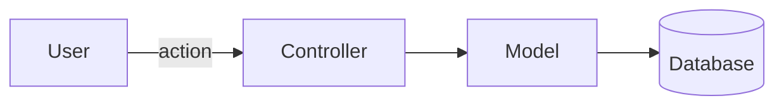
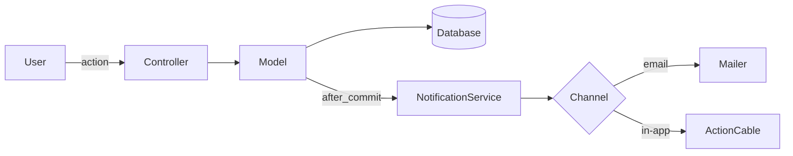

 
# Investigate Before Coding
 
Research existing code patterns, then output a concrete implementation plan. Do NOT write any production code until the user approves the plan.
 
> **Thinking budget**: Use `ultrathink` for this skill. The investigation process — connecting patterns across files, weighing architectural tradeoffs, and structuring a coherent plan — benefits heavily from extended reasoning. Think deeply before outputting the plan, not while outputting it.
 
## Step 1: Understand the Task
 
- If `$ARGUMENTS` starts with a number or `#`, treat it as a GitHub issue — run `gh issue view <number>` to fetch details. Extract requirements, acceptance criteria, and edge cases.
- If `$ARGUMENTS` is a description, use it directly.
- If no arguments, ask the user what to investigate.
### GitHub issue handling
 
If working from a GitHub issue, gather the full context — not just the description:
 
- **Comments**: Run `gh issue view <number> --comments` — they often contain revised requirements or decisions that override the original description.
- **Related issues & PRs**: Check for linked references. Run `gh issue view <number>` and look for "related" or "referenced by" links. Also search for prior attempts: `gh pr list --search "<issue number>" --state all` can reveal closed PRs with partial work or abandoned approaches worth understanding.
- **Commit history**: Run `git log --oneline --grep="#<number>"` to find commits that reference this issue — someone may have started work or made related changes.
### Error handling
 
If `gh` CLI fails (not installed, not authenticated, or the issue doesn't exist), don't stall:
- **gh not found**: Tell the user `gh` CLI is required and suggest `gh auth login`. Alternatively, ask for the issue URL and use the issue description provided manually.
- **Issue not found**: Confirm the issue number with the user. Check if it's in a different repo (`gh issue view <number> -R owner/repo`).
- **Auth error**: Run `gh auth status` to diagnose, then tell the user what to fix.
## Step 2: Find Existing Patterns (MANDATORY)
 
Before proposing anything, study how the codebase already solves similar problems. This is the most important step — skipping it leads to implementations that feel foreign to the project.
 
### What to search for
 
Find 2–3 reference files that demonstrate how the codebase handles analogous features. Concretely:
 
- **Similar features**: If building a "bookmark" feature, search for how "favorites" or "likes" already work. The closest analogy is your best template.
- **Architecture conventions**: How are things structured? What layers exist? Where does business logic live vs. presentation logic?
- **Routing/URL patterns**: Search route definitions or config files to understand the existing URL structure for the relevant area.
- **Shared code**: Look for modules, helpers, concerns, base classes, or utilities that should be reused — not duplicated.
- **Project docs and conventions**: Check for a `docs/`, `CONTRIBUTING.md`, `ARCHITECTURE.md`, or similar. These often encode decisions that aren't obvious from code alone.
- **I18n / localization**: If the feature has UI, check existing locale files for the namespace pattern and which locales are required.
- **Tests**: Find tests for similar features — they reveal the expected testing style, framework, and coverage expectations.
### How to search effectively
 
Be specific with search queries. Broad searches waste time.
 
```bash
# Find files related to a concept
grep -r "bookmark" --include="*.rb" -l          # list files only
grep -r "def create" app/controllers/ -l         # find controller actions
 
# Find the structure of a similar feature
find . -path "*/favorites*" -not -path "*/node_modules/*"
 
# Check route definitions
grep -r "resources\|route\|path" config/routes* routes/ --include="*.rb" --include="*.ts" --include="*.js"
 
# Read project conventions
find . -maxdepth 2 -iname "*.md" | head -20
```
 
Adapt these examples to the project's language and framework. The point is: use targeted searches, read actual code, and never guess at patterns.
 
### What "done" looks like
 
You should be able to say: "Feature X in `path/to/file` does something very similar. I'll follow that pattern because [reason]." If you can't find a close analogy, say so explicitly — that's valuable information, not a failure.
 
### Pause and think
 
After gathering all reference code, STOP searching and think deeply before writing anything. In your extended thinking, work through:
- Which reference implementation is the closest match and why?
- What are the architectural implications — does this change touch one layer or multiple?
- What could go wrong? Are there edge cases the issue doesn't mention?
- Is there shared code that MUST be reused vs. code that COULD be reused?
- What's the minimal set of changes needed?
This is the highest-leverage moment in the investigation. Rushing from "I found some files" to "here's my plan" produces shallow plans. Take the time here.
 
## Step 3: Architecture Overview (when needed)
 
If the task introduces new components, changes data flow, adds integrations, or restructures existing modules, generate a mermaid diagram to make the impact visible before diving into file-level details.
 
### When to include a diagram
 
Include an architecture diagram when:
- A new service, module, or major component is being added
- Data flow between existing components changes
- New external dependencies or integrations are introduced
- The task touches 3+ layers of the stack (e.g., DB + backend + frontend)
- The relationship between components isn't obvious from a file list alone
Skip the diagram for localized changes — a bug fix in one file, a copy change, adding a field to an existing form that already has the pattern established.
 
### What to diagram
 
Show the parts of the system relevant to the change, not the entire project. Use a **"before → after"** approach when modifying existing architecture, or a single diagram when building something new.
 
Pick the mermaid diagram type that best fits the situation:
 
- **flowchart / graph**: for request flows, data pipelines, component relationships
- **sequenceDiagram**: for multi-step interactions between services or actors
- **erDiagram**: for data model changes (new tables, new relationships)
- **stateDiagram-v2**: for lifecycle or status transitions
**Example — adding a notifications system:**
 
~~~
### Current Architecture (relevant area)

 
### Proposed Architecture

~~~
 
Keep diagrams focused: 5–10 nodes is ideal. If it needs more, split into multiple diagrams by concern (e.g., one for data model, one for request flow).
 
## Step 4: Output the Plan
 
Present a clear plan using this structure:
 
```
## Investigation Summary
[1–2 sentences: what the task is and which existing pattern it follows]
 
## Reference Implementation
[Which existing code you studied and why it's the right template]
[2–3 file paths with short code snippets showing the key pattern]
[Explain: "I'll follow this pattern because…"]
 
## Approach
[1–2 sentences: which approach and WHY it matches existing conventions]
[If there's a meaningful tradeoff, state the alternative you rejected and why]
 
## Architecture Overview (if architectural changes are involved)
[Mermaid diagram(s) showing how the change fits into the system]
[For modifications: show "current" and "proposed" side by side]
[For new features: show where the new components sit in the existing system]
 
## Changes
 
Files to modify:
1. `path/to/file` — what changes and why
2. …
 
Files to create:
1. `path/to/new_file` — purpose
2. …
 
## Test Plan
- How to verify the implementation works (automated tests + manual checks)
 
## Risk Flags (if any)
[Flag areas that need extra review. Look for:]
- Auth/permissions changes — could this accidentally expose or restrict access?
- Database migrations — are they reversible? Any data loss risk?
- Public API contract changes — will this break existing consumers?
- Performance-sensitive paths — hot loops, N+1 queries, large dataset handling?
- Third-party dependencies — new gems/packages, API rate limits, vendor lock-in?
[If none of these apply, omit this section.]
 
## Complexity Estimate
[One of: **Small** (1-2 files, <1 hour) / **Medium** (3-5 files, half day) / **Large** (6+ files, 1+ days)]
[One sentence justifying the estimate, e.g., "Medium — new model + controller + view, but following an established pattern closely."]
 
## Open Questions (if any)
- Anything ambiguous that needs user input before coding
```
 
Omit sections that don't apply. If there are no open questions, don't include that section. If no new files are needed, skip "Files to create." If the change is localized and doesn't affect architecture, skip "Architecture Overview." If no risky areas are identified, skip "Risk Flags." Always include "Complexity Estimate" — it takes one line and helps the user gauge review effort.
 
## Step 5: STOP and Wait
 
After outputting the plan:
- Do NOT start coding
- Do NOT create or edit any files
- Ask: **"Does this plan look good? Any changes before I start?"**
- Only proceed after explicit approval
### When the user says "no" or requests changes
 
- **"Change the approach"**: Re-read the reference code with the user's feedback in mind. Search for additional patterns if the user pointed you toward a different analogy. Output a revised plan — don't patch the old one, rewrite the relevant sections cleanly.
- **"Too much scope"**: Remove files and steps until the user agrees on boundaries. Ask: "Which parts should I keep?"
- **"Wrong pattern"**: Ask which existing code the user thinks is a better template. Read it, then revise.
- **"I want to see options"**: This overrides the "one approach" principle. Present 2 approaches max, with clear tradeoffs for each, and let the user pick.
Never re-investigate from scratch unless the user explicitly says the entire direction is wrong. Default to surgical revisions of the plan.
 
## Principles
 
- **Pattern-first**: Always find and read existing patterns before proposing. Show the actual code you found — not summaries from memory.
- **Minimal scope**: Only include files that MUST change. When in doubt, do less.
- **No guessing**: If you can't find a reference pattern, say so and ask the user. Never assume an approach without evidence from the codebase.
- **One approach**: Pick the approach that best matches existing patterns and commit to it. If genuinely ambiguous, ask — don't present a menu of options.
- **Scale the effort**: A one-line bug fix needs a short plan. A new feature needs the full investigation. Match the depth of research to the size of the task.
